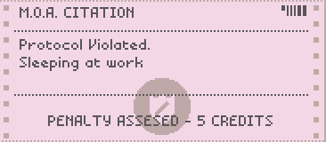

# "Papers Please" citation generator 

A python script to generate citation slips from "Papers Please" game as a PNG file.

---
Usage: `./citation.py "Protocol Violated.;Sleeping at work" "Penalty assessed - 5 credits"` - gives output like below.

Use `./citation.py --help` to get list of options.

Live web version is [here](https://saphi.re/papers_please).

---
All python, typescript, html and css code in the project is licensed under `GNU AGPL-3.0`.

